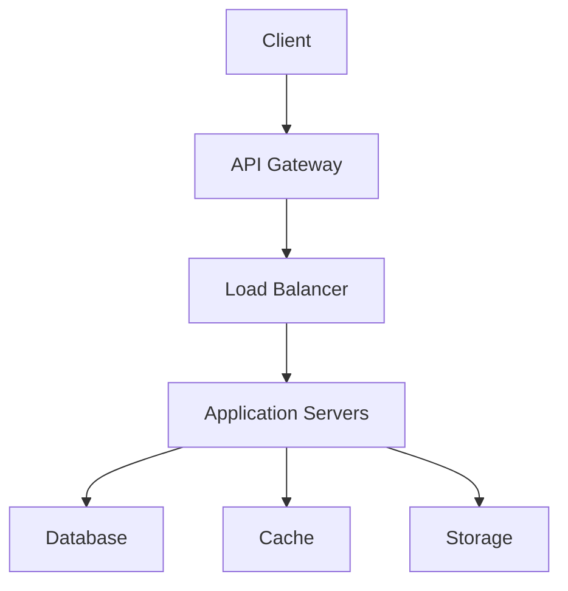

# Deployment

This document outlines the deployment process for SmartPouch_v2.

## Deployment Architecture

### 1. System Components


### 2. Infrastructure Requirements
- Compute resources
- Storage capacity
- Network bandwidth
- Security measures

## Deployment Process

### 1. Environment Setup
```bash
# Create virtual environment
python -m venv venv
source venv/bin/activate

# Install dependencies
pip install -r requirements.txt

# Set up environment variables
cp .env.example .env
```

### 2. Configuration
```python
# config.py
class Config:
    DEBUG = False
    TESTING = False
    DATABASE_URI = os.getenv('DATABASE_URI')
    API_KEY = os.getenv('API_KEY')
    MODEL_PATH = os.getenv('MODEL_PATH')
```

## Containerization

### 1. Dockerfile
```dockerfile
FROM python:3.8-slim

WORKDIR /app

COPY requirements.txt .
RUN pip install -r requirements.txt

COPY . .

CMD ["python", "app.py"]
```

### 2. Docker Compose
```yaml
version: '3'
services:
  web:
    build: .
    ports:
      - "5000:5000"
    environment:
      - DATABASE_URI=postgresql://user:pass@db:5432/dbname
    depends_on:
      - db
  db:
    image: postgres:13
    environment:
      - POSTGRES_USER=user
      - POSTGRES_PASSWORD=pass
      - POSTGRES_DB=dbname
```

## CI/CD Pipeline

### 1. GitHub Actions
```yaml
name: CI/CD Pipeline

on:
  push:
    branches: [ main ]
  pull_request:
    branches: [ main ]

jobs:
  test:
    runs-on: ubuntu-latest
    steps:
      - uses: actions/checkout@v2
      - name: Set up Python
        uses: actions/setup-python@v2
        with:
          python-version: '3.8'
      - name: Install dependencies
        run: |
          python -m pip install --upgrade pip
          pip install -r requirements.txt
      - name: Run tests
        run: |
          pytest
```

### 2. Deployment Stages
1. Development
2. Testing
3. Staging
4. Production

## Monitoring

### 1. Health Checks
```python
@app.route('/health')
def health_check():
    return {
        'status': 'healthy',
        'timestamp': datetime.now().isoformat(),
        'version': '1.0.0'
    }
```

### 2. Metrics Collection
- Performance metrics
- Error rates
- Resource usage
- User statistics

## Security

### 1. Authentication
```python
def authenticate_request(request):
    api_key = request.headers.get('X-API-Key')
    if not api_key or api_key != os.getenv('API_KEY'):
        raise UnauthorizedError()
    return True
```

### 2. Authorization
```python
def authorize_user(user, resource):
    if not user.has_permission(resource):
        raise ForbiddenError()
    return True
```

## Backup and Recovery

### 1. Database Backup
```bash
#!/bin/bash
pg_dump -U user -d dbname > backup.sql
```

### 2. Model Backup
```python
def backup_model(model, version):
    backup_path = f'models/backup_{version}.pkl'
    joblib.dump(model, backup_path)
```

## Scaling

### 1. Horizontal Scaling
- Load balancing
- Service replication
- Data sharding

### 2. Vertical Scaling
- Resource optimization
- Performance tuning
- Cache management

## Best Practices

1. Use environment variables
2. Implement health checks
3. Set up monitoring
4. Regular backups
5. Security measures

## Related Documents

- [Model Training](model_training.md)
- [Model Evaluation](model_evaluation.md)
- [One Record Implementation](one_record_implementation.md)

## Next Steps

1. Set up deployment pipeline
2. Configure monitoring
3. Implement security measures
4. Document procedures

---

*Last updated: March 10, 2024* 