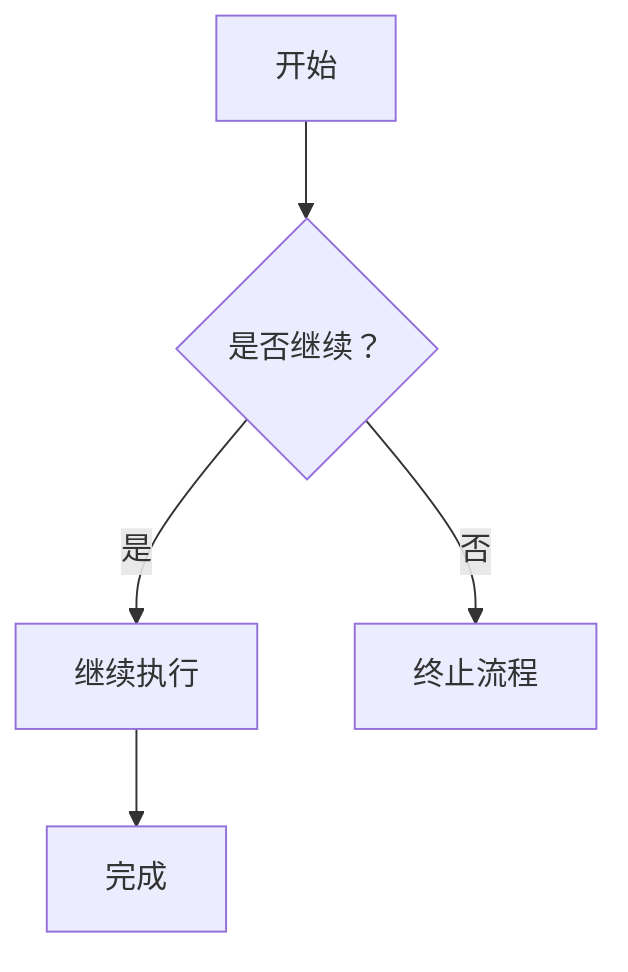
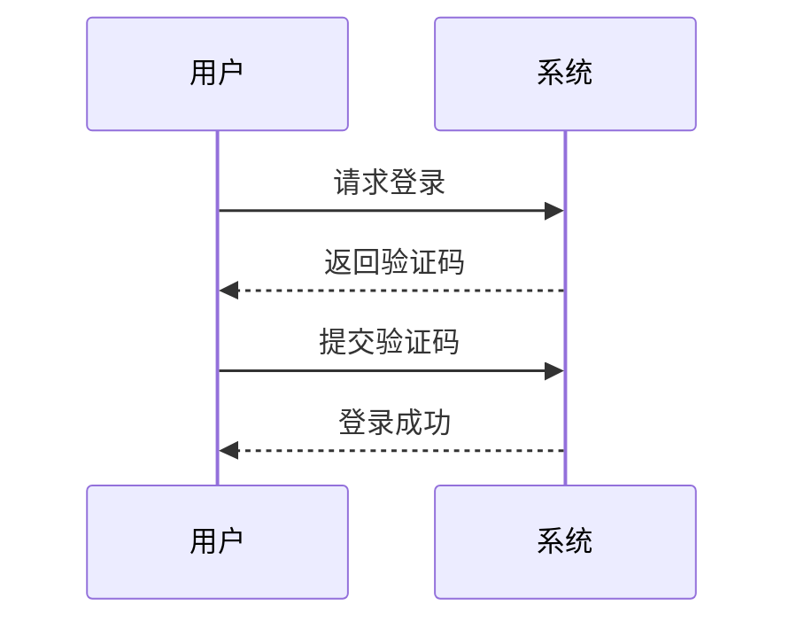
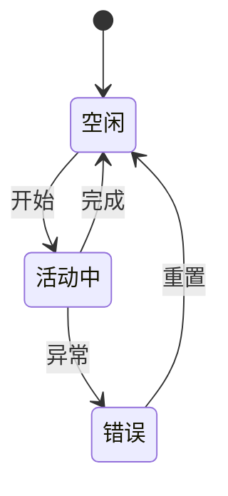
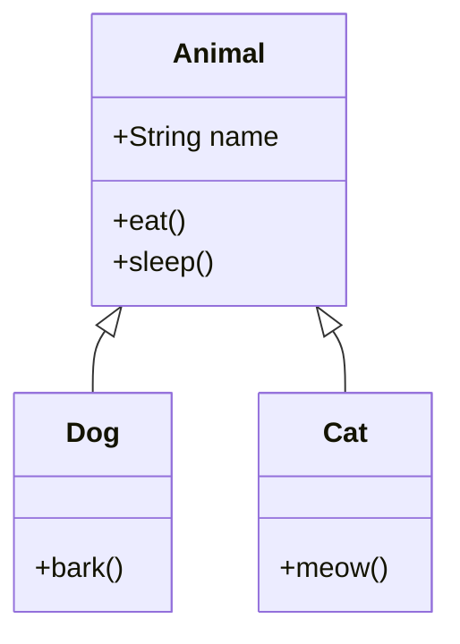
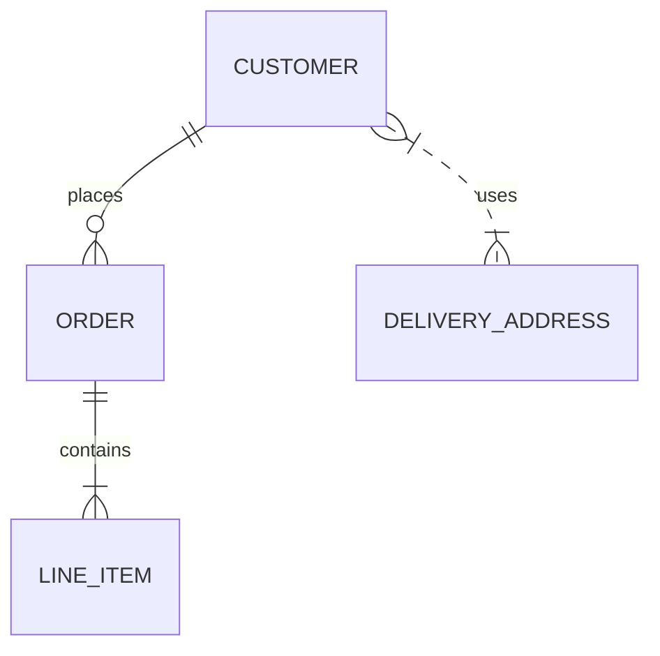
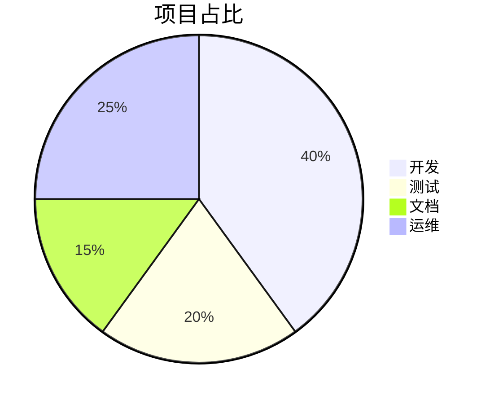
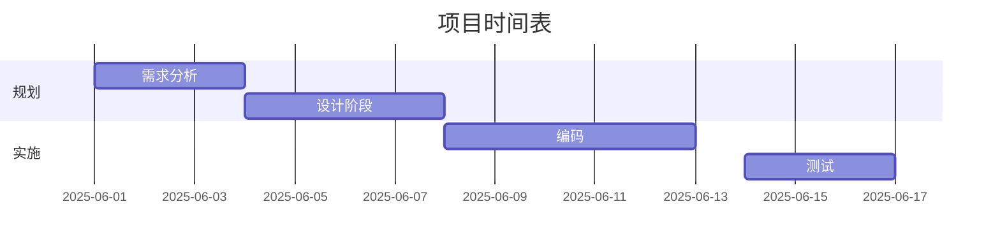
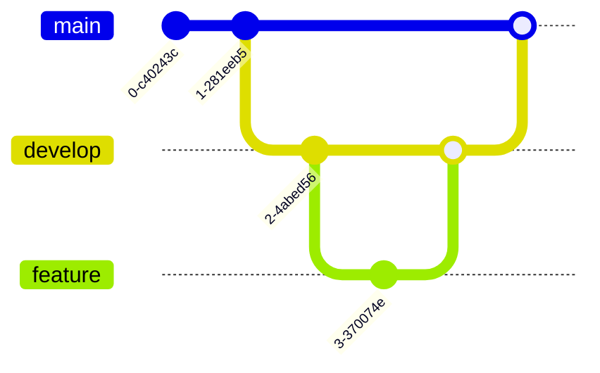
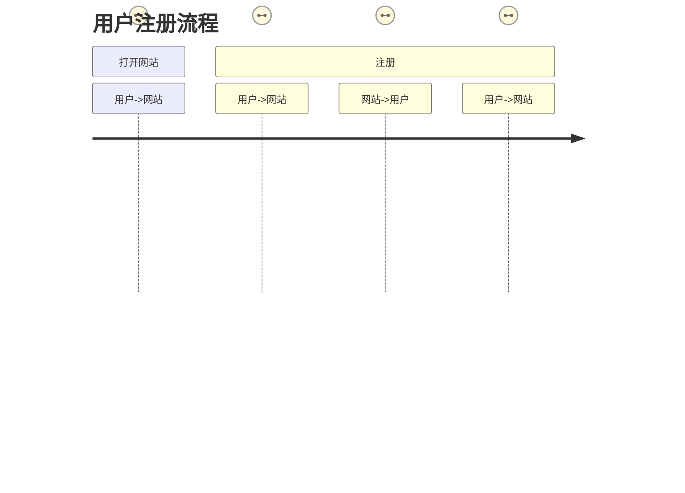
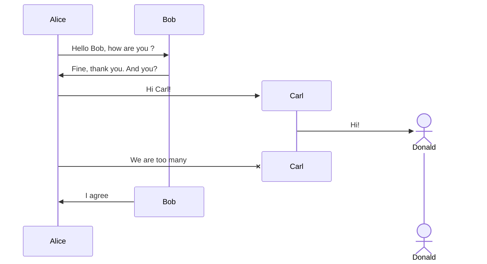

# Mermaid 图表示例合集

以下展示了 Mermaid 的主要图表示例，包含从最基础的流程图，到复杂的 Git 图、需求图等。

---

## 1. 流程图 (Flowchart)

---

## 2. 时序图 (Sequence Diagram)

---

## 3. 状态图 (State Diagram)

---

## 4. 类图 (Class Diagram)

---

## 5. 实体关系图 (ER Diagram)

---

## 6. 饼图 (Pie Chart)

---

## 7. 甘特图 (Gantt Chart)

---

## 8. Git 图 (Git Graph)

---

## 9. 用户旅程图 (User Journey)

---

## 10. 需求图 (Requirement Diagram)

---
