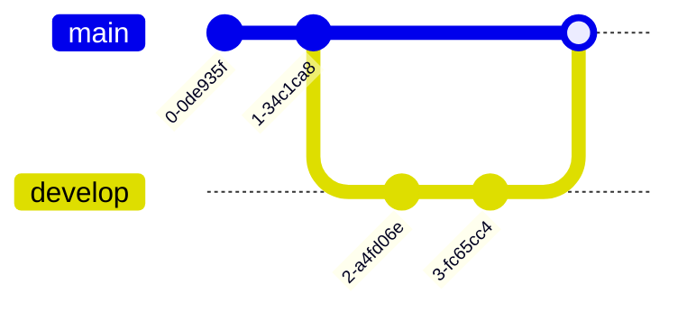

# Mermaid 示例文档

下面展示了 Mermaid 支持的各种图表类型。

---

## 1. Flowchart (流程图)

---

## 2. Sequence Diagram (时序图)

---

## 3. Gantt Chart (甘特图)

---

## 4. Class Diagram (类图)

---

## 5. State Diagram (状态图)

---

## 6. ER Diagram (实体关系图)

---

## 7. Pie Chart (饼图)

---

## 8. Mind Map (思维导图)

---

## 9. Git Graph (Git 图)

---

## 10. Timeline (时间线)

---

## 11. User Journey (用户旅程图)

